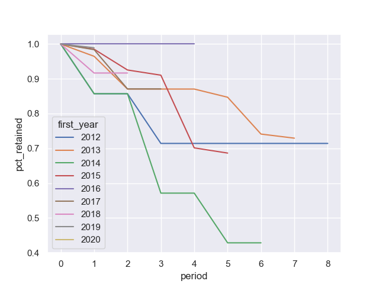

Análise de cohorts
------------------

Código baseado no capítulo 04 do livro: [SQL for Data Analysis](https://www.oreilly.com/library/view/sql-for-data/9781492088776/ch04.html)

Ele permite gerar gráficos para análise de cohort (safras), como a seguir:



Para rodar as queries contidas na pasta `Scripts`, foi utilizado o PostgreSQL. 

É possível instalar ele numa máquina com OS X usando o homebrew:

```
brew install postgresql
```

E depois ativar o serviço com:

```
brew services start postgresql
```

Para criar o banco de dados, usar o comando:

```
psql -d postgres
create database cohort owner cassio
```

Após o banco criado, para criar as tabelas usar:

```
psql -U cassio -d cohort < create_legislators_table.sql
psql -U cassio -d cohort < create_legislators_terms.sql
```

Lembrar de alterar o caminho para os arquivos .csv dentro dos scripts de criação das tabelas acima.

As queries para geração dos cohorts estão no arquivo `Scripts/Script.sql`